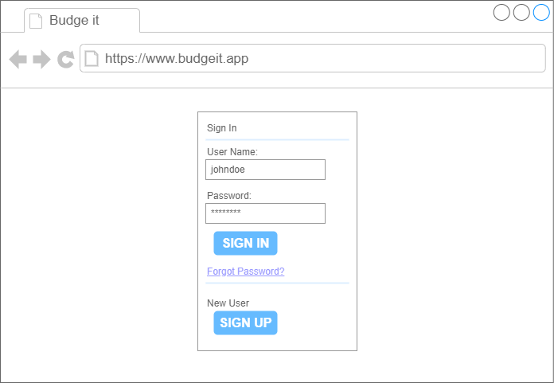
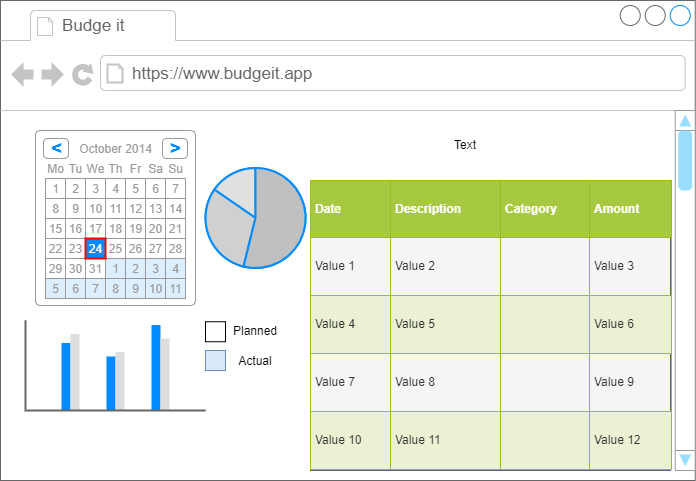
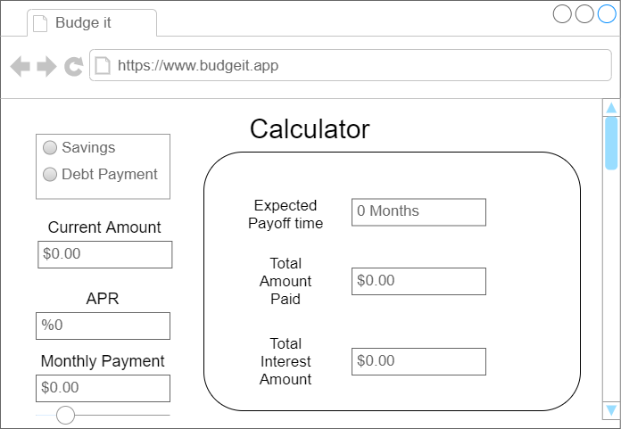

# Budge-It

# Concept Description
This application is created to make budgeting easier!
Budgeting can be a difficult and daunting task and many people don't know where to start. From paying off debt to starting a savings account, this application can assist users manage their financial life and have a better understanding on where their hard earned money is being allocated.

# Table of Content
1. [User Stories](https://github.com/phildh89/Budge-It#user-stories)
2. [Use-Case](https://github.com/phildh89/Budge-It#use-case)
3. [UML Diagram](https://github.com/phildh89/Budge-It#uml-diagram)
4. [Scenario](https://github.com/phildh89/Budge-It#scenario)
5. [Entity Relationship Diagram](https://github.com/phildh89/Budge-It#entity-relationship-diagram)
6. [Wire-Frame (Draft)](https://github.com/phildh89/Budge-It#wire-frames-draft)
7. [Requirements](https://github.com/phildh89/Budge-It#requirements)
8. [Requirements Table](https://github.com/phildh89/Budge-It#requirements-table)
9. [Test Table](https://github.com/phildh89/Budge-It#test-table)

# User Stories
*	As a college student, I want to pay off my debt so that I pay the least amount of interest possible given my current income and lifestyle. 
*	As a parent, I want to allocate money for savings so that I have a retirement fund and college fund for my kids. 
*	As a student, I want to know where my money is being spent so that I can learn how to manage my finances. 

# Use-Case
*	The User enters user information  
*	The User enters Checking account transaction 
*	The User enters Loans/Credit card transaction 
*	The User enters Savings account transaction 
*	The System stores transaction input 
*	The System outputs numeric results of transactions 
*	The System outputs chart representation of transactions 
*	The System outputs calculations on debt interest 

# UML Diagram

# Scenario

  Given when the user account has been created and transactions have been populated, when the user loads the home screen then statistics and charts will show a summary of the user’s financial standings. There will be options to look at savings and debt paying recommendations.
  

# Entity Relationship Diagram

# Wire-frames

# Requirements

### `1.0 Account Registration`
The system shall allow users to register for accounts. The registration feature will be located on the home view. The user will enter personal information such as First Name, Last Name, Email, Date of Birth, Username and Password.

### `1.1	Log-In Function`
The system shall allow user will enter username and password to request the database to verify username and password match.

### `1.2	Bank Account Data`
The system shall allow user to log into bank API to pull data and push into system database. This will populate the transaction information needed for summary view page.

##### `1.2.1 User input transactions`
The system shall allow user to edit or input addition transaction information into specified account to increase readability for the user.

### `1.3	Transaction Summary`
The system shall return data from the database based on the users filter to return total usage of accounts. The view will be numeric and visual via charts

### `1.4	Interest Calculator`
The system shall all user to enter desired amount to put into savings accounts or amount to pay off debt from credit cards or loans. The system will return data based on transactions from database and APR/interest based on the account. The view will return payment or savings plans based on user input.

# Requirements Table

Req ID|Requirements Cases Description|Test Method|Test ID|Tested
---|---|---|---|---
1|The system shall allow users to register for accounts|Demonstration|T001|No
2|The system shall allow users to log in|Test|T001|No
3|The system shall allow users to update user information|Test|T001|No
4|The system shall provide summary/home page|Inspection|T002|No
5|The system shall provide user to input banking information to pull from bank API|Inspection|T003|No
6|The system shall allow user to navigate webpages using clickable buttons|Test|T004|No
7|The system shall provide bank account total|Inspection|T003|No
8|The system shall allow user to interact with account calculators for savings and debt|Test|T005|No
9|The system shall allow users to save calculator inputs for future use|Analysis|T005|No
10|The system shall provide suggested payment and savings options|Inspection|T006|No
11|The system shall allow user to log out of account|Test|T007|No

# Test Table

Test ID|Req ID|Test Procedure|Current Status|Time Stamp|Build Version
---|---|---|---|---|---
T001|1, 2, 3|Create test account. Log in with test account. Edit account information.|Not tested||
T002|4|Use test account to check if information for the home/summary page loads.|Not tested||
T003|5, 7|Use bank account log in to test if API works and if information provided is presented in the intended format.|Not tested||
T004|6|Click through website to ensure all navigational buttons works as intended|Not tested||
T005|8, 9|Test debt and savings calculator with test inputs and save informtion. Exit and reenter the webpage to check if saved information returns.|Not tested||
T006|10|Inspect if suggested payment and savings options are returned.|Not tested||
T007|11|Log out of test account and ensure the follow page is the log in page.|Not tested||
